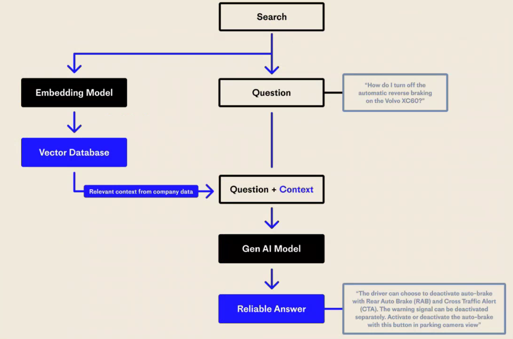
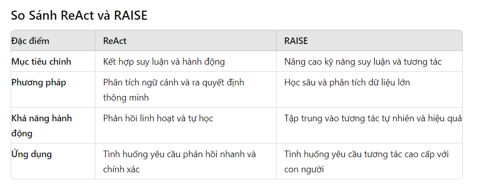
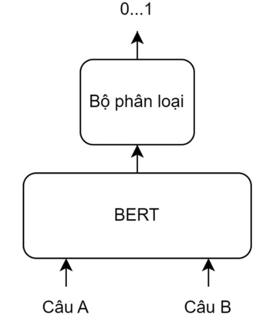

# Important parameter of llm

1. **Context windown**

Mô tả: Cửa sổ ngữ cảnh của LLM là số lượng mã thông báo mà mô hình có thể lấy làm đầu vào khi tạo phản hồi.
Phạm vi giá trị:trong GPT-3, kích thước cửa sổ ngữ cảnh là 2K (2000) và trong GPT-4, kích thước cửa sổ ngữ cảnh là 32K lớn hơn.

2. **Temperature:**

Mô tả: Temperature điều chỉnh độ ngẫu nhiên của mô hình trong việc tạo ra văn bản.
Phạm vi giá trị: 0.0 đến 1.0.
Giá trị thấp: Văn bản ít ngẫu nhiên hơn, sẽ mang tính tập trung và mang tính quyết định hơn
Giá trị cao: Có tính ngẫu nhiên và đa dạng hơn trong văn bản được tạo ra

3. **Max Tokens:**

Mô tả: Giới hạn số lượng token mà mô hình sẽ tạo ra trong một phản hồi.
Quan trọng để: Tránh phản hồi quá dài và kiểm soát chi phí tính toán.

4. **Top-p (Nucleus Sampling):**

Mô tả: Điều chỉnh độ ngẫu nhiên bằng cách chọn từ những token có xác suất cộng dồn đến một ngưỡng xác định.
Phạm vi giá trị: 0.0 đến 1.0.
Giá trị thấp: Chọn từ những token có xác suất cao nhất (hạn chế các lựa chọn và tạo ra các phản hồi tập trung hơn.).
Giá trị cao: Tăng sự đa dạng bằng cách bao gồm nhiều token hơn (tăng tính đa dạng đầu ra).

5. **Top-n:**
Top N là một tham số khác được sử dụng để lấy mẫu mã thông báo tiếp theo, tương tự như top P. Tuy nhiên, thay vì sử dụng phân phối xác suất tích lũy, top N chỉ xem xét N mã thông báo có khả năng xảy ra cao nhất ở mỗi bước. Bằng cách điều chỉnh giá trị N hàng đầu.
Phạm vi giá trị: 0.0 đến 10.
Giá trị cao: cho phép xem xét nhiều lựa chọn hơn, dẫn đến các phản hồi đa dạng
Giá trị thấp: sẽ hạn chế các lựa chọn và tạo ra các phản hồi tập trung hơn.

6. **Frequency Penalty:**

Mô tả: Điều chỉnh để giảm thiểu việc lặp lại các token trong văn bản.
Phạm vi giá trị: -2.0 đến 2.0.
Giá trị cao: Ít lặp lại hơn.
Giá trị thấp: Nhiều lặp lại hơn.

7. **Presence Penalty:**

Mô tả: Tham số này hữu ích khi bạn muốn tránh nội dung hoặc thành kiến ​​nhất định trong văn bản được tạo.
Phạm vi giá trị: -2.0 đến 2.0.
Giá trị cao: giảm khả năng xuất hiện các từ hoặc cụm từ cụ thể trong đầu ra .

8. **Stop Sequences:**

Mô tả: Một danh sách các chuỗi token mà khi gặp phải, mô hình sẽ dừng tạo ra văn bản.
Quan trọng để: Kết thúc phản hồi đúng lúc.

9. **Logits Bias:**

Mô tả: Điều chỉnh xác suất của các token cụ thể trong quá trình tạo văn bản.
Quan trọng để: Hạn chế hoặc khuyến khích các token nhất định.
Các tham số này giúp điều chỉnh hành vi của mô hình, cho phép tạo ra các phản hồi từ rất cụ thể và chặt chẽ đến sáng tạo và ngẫu nhiên hơn tùy theo yêu cầu của người sử dụng.

# Large Action Model

LAM là mô hình trí tuệ nhân tạo có thể hiểu và thực hiện các nhiệm vụ phức tạp bằng cách chuyển đổi ý định của con người thành hành động. Trong LAM, các mức độ tự chủ và hiểu biết như vậy biến AI tạo ra thành một trợ lý tích cực có thể thực hiện nhiều nhiệm vụ khác nhau, từ đặt phòng đến đưa ra quyết định phức tạp dựa trên phân tích dữ liệu trong quá khứ và hiện tại. 

# ReAct vs RAISE

1. **ReAct Prompting**

ReAct là một mô hình chung kết hợp lý luận và hành động với LLM. ReAct nhắc LLM tạo ra các dấu vết lý luận bằng lời và hành động cho một nhiệm vụ. Điều này cho phép hệ thống thực hiện lý luận động để tạo, duy trì và điều chỉnh các kế hoạch hành động đồng thời cho phép tương tác với môi trường bên ngoài (ví dụ: Wikipedia) để kết hợp thông tin bổ sung vào lý luận. Hình bên dưới cho thấy một ví dụ về ReAct và các bước khác nhau liên quan để thực hiện trả lời câu hỏi.

Input:  Aside from the Apple Remote, what other devices can control the program Apple Remote was originally designed to interact with?

2. **ReAct (Reasoning and Acting)**

ReAct tập trung vào việc kết hợp giữa khả năng suy luận (reasoning) và hành động (acting) của hệ thống AI. Mục tiêu là tạo ra các mô hình AI có khả năng hiểu và phân tích các tình huống phức tạp, sau đó thực hiện các hành động dựa trên sự hiểu biết đó.

**Đặc điểm chính**

Nâng Cao Kỹ Năng Suy Luận:

Học Tập Sâu: RAISE sử dụng các phương pháp học sâu (deep learning) để nâng cao khả năng suy luận của hệ thống AI, giúp hiểu sâu hơn về các tình huống phức tạp.
Phân Tích Dữ Liệu Lớn: Sử dụng các kỹ thuật phân tích dữ liệu lớn để cải thiện khả năng suy luận và đưa ra các dự đoán chính xác.

Tăng Cường Tương Tác:

Giao Tiếp Tự Nhiên: RAISE tập trung vào việc phát triển khả năng giao tiếp tự nhiên của AI, giúp hệ thống tương tác một cách tự nhiên và hiệu quả với con người.
Kỹ Năng Tương Tác Cao Cấp: RAISE chú trọng vào việc cải thiện các kỹ năng tương tác cao cấp như đàm phán, thuyết phục, và hợp tác.

# TÌm hiểu hệ sinh thái Hugging Face

Hugging Face là một nền tảng tuyệt vời cung cấp một bộ công cụ mạnh mẽ cho nhiều tác vụ khác nhau. Các thành phần chính của hệ sinh thái Hugging Face là Hub, thư viện Transformers & Diffusers, Inference API và trình xây dựng ứng dụng web Gradio. Trong phần này, chúng ta sẽ thảo luận về các thành phần này.

1. **The Hub**

Mô hình

Bộ dữ liệu

Không gian: cho phép triển khai các ứng dụng demo học máy. Các ứng dụng này giúp xây dựng danh mục đầu tư ML, giới thiệu các dự án và làm việc cộng tác với những người khác.

2. **The Transformer and Diffusers Libraries**

Thư viện Transformer

Transformers là một thư viện mã nguồn mở cung cấp API và công cụ, dễ dàng tải xuống và đào tạo các mô hình được đào tạo trước tiên tiến nhất. 

Thư viện Diffusers

Thư viện này cung cấp một cách dễ dàng để chia sẻ, phiên bản và tái tạo các mô hình khuếch tán được đào tạo trước, cho các tác vụ thị giác máy tính và âm thanh. Thư viện này tập trung vào các mô hình khuếch tán, và đặc biệt là Stable Diffusion. Thư viện Diffusers cho phép sử dụng Stable Diffusion một cách dễ dàng. 

3. **The Inference API**

Giả sử muốn đưa một mô hình trong Hugging Face vào môi trường sản xuất. Có thể sử dụng API Giao diện Hugging Face cho việc này.Tóm lại, Inference API cho phép tích hợp các mô hình NLP vào các ứng dụng hiện có của mình mà không cần phải viết mã phức tạp. 

4. **Gradio**

Dễ dàng xây dựng giao diên 

# Phân biệt Pretrained , SFT, RLHF

1. **Pretrained (Pre-trained):**

Mô hình được huấn luyện sẵn (pre-trained model) là các mô hình đã được huấn luyện trước trên một lượng lớn dữ liệu từ nguồn đào tạo nổi tiếng như Wikipedia hoặc dữ liệu web lớn khác. Những mô hình này đã học được những đặc trưng ngôn ngữ tổng quát và có khả năng xử lý nhiều tác vụ khác nhau trong lĩnh vực xử lý ngôn ngữ tự nhiên (NLP) hoặc thị giác máy tính.

2. **SFT (Supervised Fine-tuned):**

Phương pháp này tuyển chọn một tập dữ liệu gồm các đầu ra LLM chất lượng cao mà mô hình được tinh chỉnh trực tiếp bằng cách sử dụng mục tiêu mô hình hóa ngôn ngữ chuẩn. SFT đơn giản/rẻ để sử dụng và là một công cụ hữu ích để căn chỉnh các mô hình ngôn ngữ

3. **RLHF (Reinforcement Learning from Human Feedback):**

Mô tả: RLHF (Reinforcement Learning from Human Feedback) là một phương pháp sử dụng học tăng cường (reinforcement learning) để cải thiện mô hình AI bằng cách sử dụng phản hồi từ con người. Mô hình sẽ học từ các lần tương tác với người dùng, thông qua các hành động và phản hồi từ người dùng để cải thiện hiệu suất của nó.