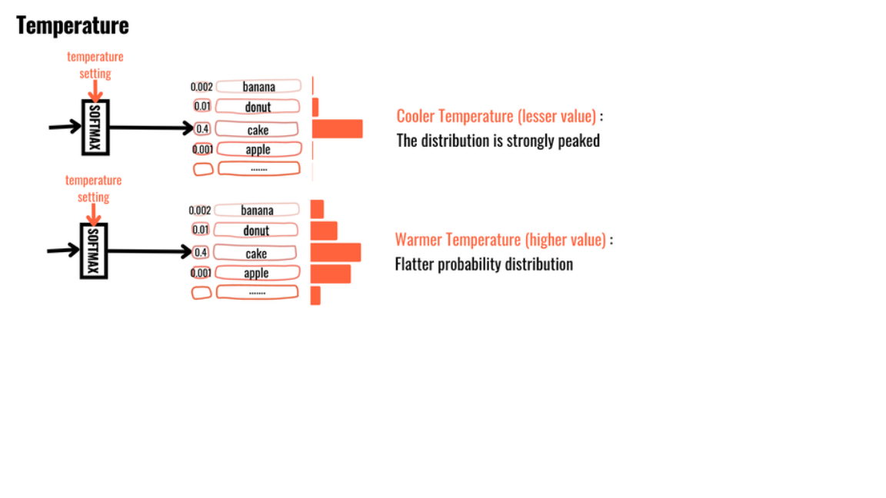
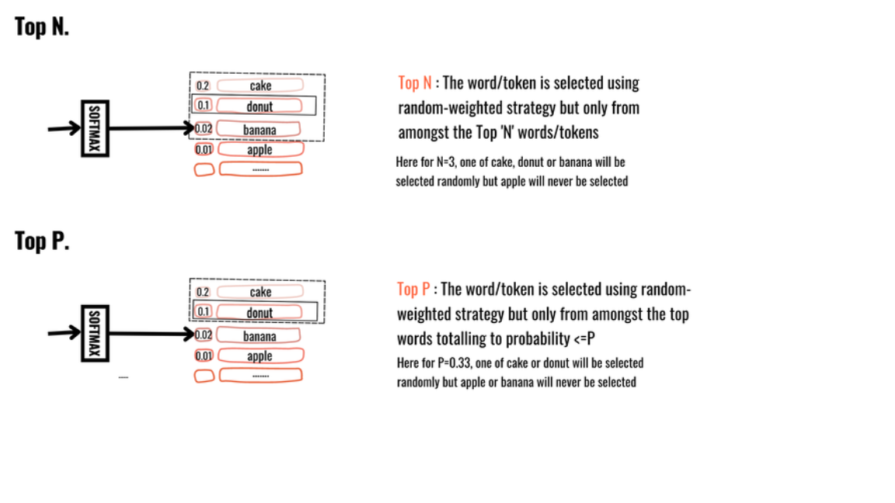

# Important parameter of llm

1. **Context windown**

Mô tả: Cửa sổ ngữ cảnh của LLM là số lượng mã thông báo mà mô hình có thể lấy làm đầu vào khi tạo phản hồi.
Phạm vi giá trị:trong GPT-3, kích thước cửa sổ ngữ cảnh là 2K (2000) và trong GPT-4, kích thước cửa sổ ngữ cảnh là 32K lớn hơn.

2. **Temperature:**

Mô tả: Temperature điều chỉnh độ ngẫu nhiên của mô hình trong việc tạo ra văn bản.
Phạm vi giá trị: 0.0 đến 1.0.
Giá trị thấp: Văn bản ít ngẫu nhiên hơn, sẽ mang tính tập trung và mang tính quyết định hơn
Giá trị cao: Có tính ngẫu nhiên và đa dạng hơn trong văn bản được tạo ra

3. **Max Tokens:**

Mô tả: Giới hạn số lượng token mà mô hình sẽ tạo ra trong một phản hồi.
Quan trọng để: Tránh phản hồi quá dài và kiểm soát chi phí tính toán.

4. **Top-p (Nucleus Sampling):**

Mô tả: Điều chỉnh độ ngẫu nhiên bằng cách chọn từ những token có xác suất cộng dồn đến một ngưỡng xác định.
Phạm vi giá trị: 0.0 đến 1.0.
Giá trị thấp: Chọn từ những token có xác suất cao nhất (hạn chế các lựa chọn và tạo ra các phản hồi tập trung hơn.).
Giá trị cao: Tăng sự đa dạng bằng cách bao gồm nhiều token hơn (tăng tính đa dạng đầu ra).

5. **Top-n:**
Top N là một tham số khác được sử dụng để lấy mẫu mã thông báo tiếp theo, tương tự như top P. Tuy nhiên, thay vì sử dụng phân phối xác suất tích lũy, top N chỉ xem xét N mã thông báo có khả năng xảy ra cao nhất ở mỗi bước. Bằng cách điều chỉnh giá trị N hàng đầu.
Phạm vi giá trị: 0.0 đến 10.
Giá trị cao: cho phép xem xét nhiều lựa chọn hơn, dẫn đến các phản hồi đa dạng
Giá trị thấp: sẽ hạn chế các lựa chọn và tạo ra các phản hồi tập trung hơn.

6. **Frequency Penalty:**

Mô tả: Điều chỉnh để giảm thiểu việc lặp lại các token trong văn bản.
Phạm vi giá trị: -2.0 đến 2.0.
Giá trị cao: Ít lặp lại hơn.
Giá trị thấp: Nhiều lặp lại hơn.

7. **Presence Penalty:**

Mô tả: Tham số này hữu ích khi bạn muốn tránh nội dung hoặc thành kiến ​​nhất định trong văn bản được tạo.
Phạm vi giá trị: -2.0 đến 2.0.
Giá trị cao: giảm khả năng xuất hiện các từ hoặc cụm từ cụ thể trong đầu ra .

8. **Stop Sequences:**

Mô tả: Một danh sách các chuỗi token mà khi gặp phải, mô hình sẽ dừng tạo ra văn bản.
Quan trọng để: Kết thúc phản hồi đúng lúc.

9. **Logits Bias:**

Mô tả: Điều chỉnh xác suất của các token cụ thể trong quá trình tạo văn bản.
Quan trọng để: Hạn chế hoặc khuyến khích các token nhất định.
Các tham số này giúp điều chỉnh hành vi của mô hình, cho phép tạo ra các phản hồi từ rất cụ thể và chặt chẽ đến sáng tạo và ngẫu nhiên hơn tùy theo yêu cầu của người sử dụng.