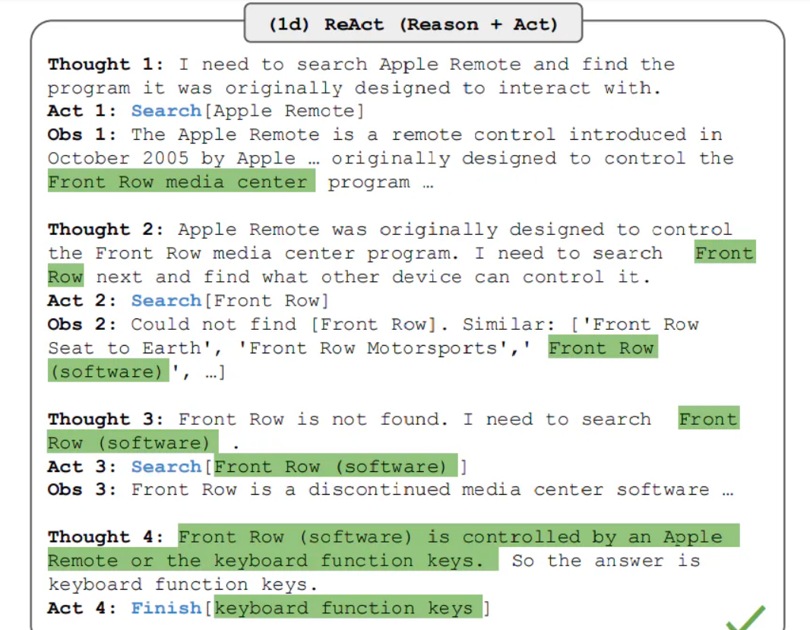
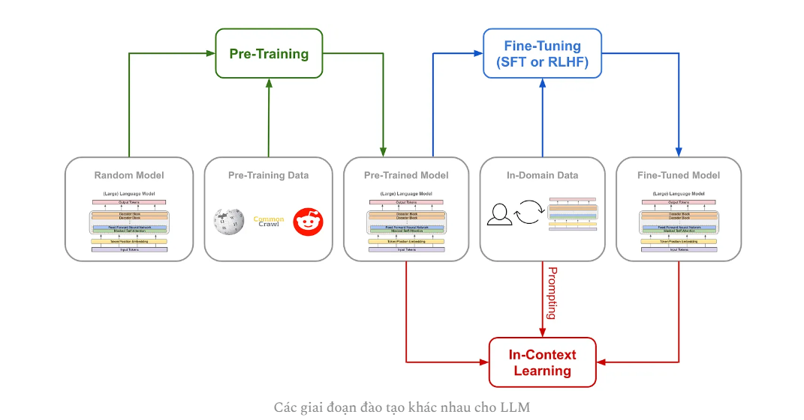

# Retrieval Augmented Generation (RAG)
## Overview
 RAG là kỹ thuật giúp cải thiện khả năng của mô hình sinh từ những dữ liệu bên ngoài.

 Phương pháp thực hiện là truy xuất các thông tin từ bên ngoài và kết hợp vào prompt cho quá trình sinh dữ liệu của LLM.

 Sự phổ biến của RAG:
 - Với các mô hình ngôn ngữ lớn, thông tin được sinh ra chỉ có trong lượng data chúng được trainning. Nếu gặp một câu hỏi nằm ngoài tri thức, chúng sẽ gặp vấn đề ảo giác (hallucination) các câu văn sinh ra rất trôi chảy nhưng không chính xác.
 - Hầu hết chúng ta đều không có đủ tài nguyên để xây dựng một LLM cho tài liệu riêng.

 Tóm tắt quá trình RAG:

 ## Retrieval: keyword search, feature search 

 **Key word search**

 BM25(best matching): Ước lượng mức độ liên quan với biễu diễn TF-IDF

Đặc điểm:
- Thuật toán đơn giản, truy xuất nhanh
- Kém hiệu quả

**Bi-encoder**

Đặc điểm:
- Các vector nhúng có thể tính trước, truy xuất nhanh
- Kém hiệu quả hơn cross-encoder

**Cross-encoder**

Ưu điểm:
- Hiệu quả cao

## Sentence embedding

Sử dụng mô hình như S-bert để tạo ra vector đặc trưng từ câu đầu vào.

**Contrastive learning**

Mục tiêu: 
- Biểu diễn của những điểm tương đồng gần nhau
- Biểu diễn của những điểm khác biệt xa nhau

Cách thức thực hiện:
- tạo dữ liệu huấn luyện: tạo ra các cặp dữ liệu dương tương đồng về ngữ nghĩa và cặp âm khác nhau về ngữ nghĩa

- Hàm encode 

- Hàm loss để cực đại độ đo tương đồng giữa cặp possitive và cực tiểu độ đo tương đồng giữa cặp negative

SimCSE cho văn bản:
- Với học có giám sát, cặp dương là cùng nhãn lớp
- Với học không giám sát, sử dụng dropout để tạo cặp positive. Cho 1 câu qua 2 lần mạng encoder có dropout thu được 2 biểu diễn là possitive. Các biểu diễn khác trong 1 batch là negative.

## Chunking Strategies

**Standard**

Sử dụng cùng một đoạn văn bản để index và nhúng và đưa ra câu phản hồi

Đặc điểm:
- Đơn giản, nhất quán giữa dữ liệu retrieval và dữ liệu trả về
- Hạn chế trong việc hiểu ngữ cảnh do LLM yêu cầu ngữ cảnh đầy đủ hơn

**Sentence Window**

Chia văn bản thành các đơn vị nhỏ hơn.

Retrieval cho các chunk nhỏ trong vector DB nhưng thêm được ngữ cảnh xung quanh window 

Đặc điểm:
- Độ phức tạp cao hơn
- Thêm được ngữ cảnh vào prompt 

**Hierarchical retrive**

Truy xuất các chunk phân mảnh, từ nhiều nguồn

Merge các chunk nhỏ dựa vào hệ thống phân cấp để có context lớn hơn.

## Vector DB

Cơ sở dữ liệu vector là cơ sở dữ liệu phi quan hệ chuyên dụng nhằm lưu trữ, xử lý cũng như truy xuất lượng lớn dữ liệu nhiều chiều ở dạng vector.** Re

## Demo chương trình chatbot đơn giản với RAG

Model embeding: simCSE-Vietnamese [link](https://huggingface.co/VoVanPhuc/sup-SimCSE-VietNamese-phobert-base)

Vector DB:
* Chunk size: 500
* Overlap: 50

Retriver: 
* Search type: Maximum Marginal Relevance
* search_kwargs: 5

LLM: API Gemini

**Demo:**

## Reranking

* Khi truy vấn trong kho dữ liệu lớn, sử dụng BM25 để chọn ra top các văn bản liên quam
* Sau đó sử dụng bi-encoder để lọc lại
* Sử dụng cross encocer để truy vấn top k văn bản liên quan nhất.

## Self-refine 

Thành phần:
* Feedback: nhận vào output y0 và cung cấp đánh giá để cải thiện
* Refine: cải thiện lại yt dựa vào feedback nhận được

Đặc diểm:
* Vòng lặp feedback -> refine -> feedback -> ...
* Self-refine lưu trữ lịch sử bằng cách nối các output trước vào prompt.

## Chain of Thought

Đưa các chuỗi suy luận phức tạp vào prompt 

Zeroshot COT prompting: ví dụ thêm vào đoạn prompt "Let's think step by step" vào prompt gốc 

Fewshot COT prompting: Thêm các ví dụ cụ thể để suy luận ra kết quả vào prompt

Automatic COT: bao gồm 2 stage:
* Stage 1: phân cụm các câu hỏi 
* Stage 2: chọn các câu hỏi đại diện mỗi cụm và sinh chuỗi suy luận từ zero shot CoT

